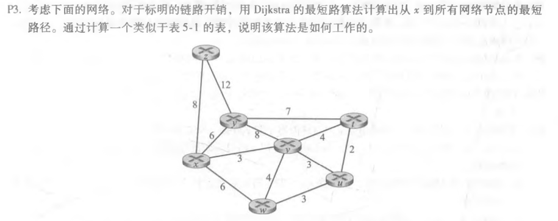
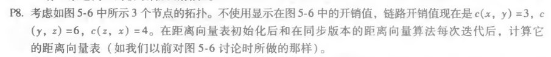
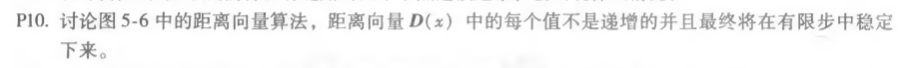

## P3

| 步骤 | N^'^    | D(t),p(t) | D(u),p(u) | D(v),p(v) | D(W),p(w) | D(y),p(y) | D(z),p(z) |
| ---- | ------- | --------- | --------- | --------- | --------- | --------- | --------- |
| 0    | x       | ∞         | ∞         | 3,x       | 6,x       | 6,x       | 8,x       |
| 1    | xv      | 7,v       | 6,v       |           | 6,x       | 6,x       | 8,x       |
| 2    | xvu     | 7,v       |           |           | 6,x       | 6,x       | 8,x       |
| 3    | xvuw    | 7,v       |           |           |           | 6,x       | 8,x       |
| 4    | xvuwy   | 7,v       |           |           |           |           | 8,x       |
| 5    | xvuwyt  |           |           |           |           |           | 8,x       |
| 6    | xvuwytz |           |           |           |           |           |           |

## P8

结点x表

|      |      | x    | y    | z    |
| ---- | ---- | ---- | ---- | ---- |
|      | x    | 0    | 3    | 4    |
| 从   | y    | ∞    | ∞    | ∞    |
|      | z    | ∞    | ∞    | ∞    |

|      |      | x    | y    | z    |
| ---- | ---- | ---- | ---- | ---- |
|      | x    | 0    | 3    | 4    |
| 从   | y    | 3    | 0    | 6    |
|      | z    | 4    | 6    | 0    |

结点y表

|      |      | x    | y    | z    |
| ---- | ---- | ---- | ---- | ---- |
|      | x    | ∞    | ∞    | ∞    |
| 从   | y    | 3    | 0    | 6    |
|      | z    | ∞    | ∞    | ∞    |

|      |      | x    | y    | z    |
| ---- | ---- | ---- | ---- | ---- |
|      | x    | 0    | 3    | 4    |
| 从   | y    | 3    | 0    | 6    |
|      | z    | 4    | 6    | 0    |

结点z表

|      |      | x    | y    | z    |
| ---- | ---- | ---- | ---- | ---- |
|      | x    | ∞    | ∞    | ∞    |
| 从   | y    | ∞    | ∞    | ∞    |
|      | z    | 4    | 6    | 0    |

|      |      | x    | y    | z    |
| ---- | ---- | ---- | ---- | ---- |
|      | x    | 0    | 3    | 4    |
| 从   | y    | 3    | 0    | 6    |
|      | z    | 4    | 6    | 0    |

## p10

在每一步中，节点距离向量的每一次更新都是基 于Bellman-Ford方程，即只减少距离向量中的这些值。价值没有增加。如果没有更新，则不会发送消息。因此，D(x)是不增加的。由于这些代价是有限的，那么最终距离向量将稳定在有限的步骤。

