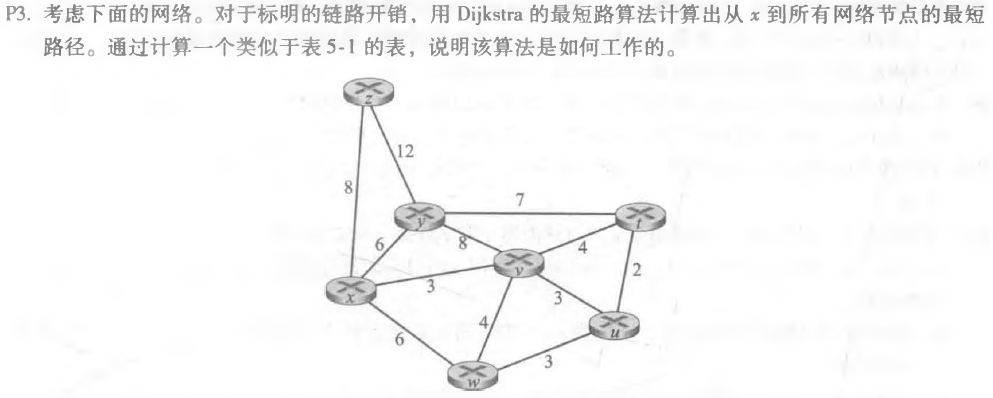
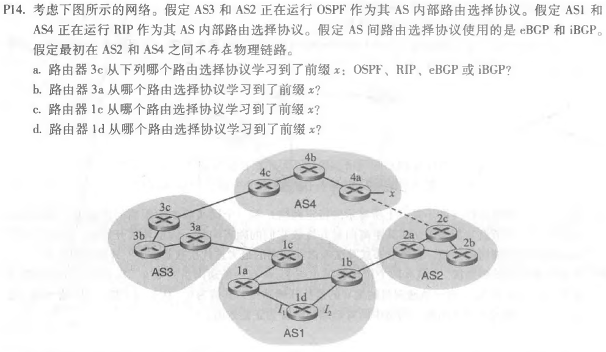

### 第九次作业

* * *

#### P3

##### 题目：

##### 作答：
|step|$N^{'}$|D(t),p(t)|D(u),p(u)|D(v),p(v)|D(w),p(w)|D(y),p(y)|D(z),p(z)|
|-|-|-|-|-|-|-|-|
|0|x|$\infty$|$\infty$|3,x|6,x|6,x|8,x|
|1|xv|7,v|6,v||6,x|6,x|8,x|
|2|xvu|7,v|||6,x|6,x|8,x|
|3|xvuw|7,v||||6,x|8,x|
|4|xvuwy|7,v|||||8,x|
|5|xvuwyt||||||8,x|
|6|xvuwytz|||||||

* * *

#### P9

##### 题目：

##### 作答：
a.不会出现无穷计数的问题。

b.因为降低链路成本不会导致循环，而是由该链路的两个节点之间的下⼀跳关系引起。

c.如果我们将没有链路的两个节点连接起来，就相当于将链路重量从⽆限降到有限权。

* * *

#### P14

##### 题目：

##### 作答：
a.路由器3c是从eBGP学习到了前缀x。

b.路由器3a是从iBGP学习到了前缀x。

c.路由器1c是从eBGP学习到了前缀x。

d.路由器1d是从iBGP学习到了前缀x。

* * *
