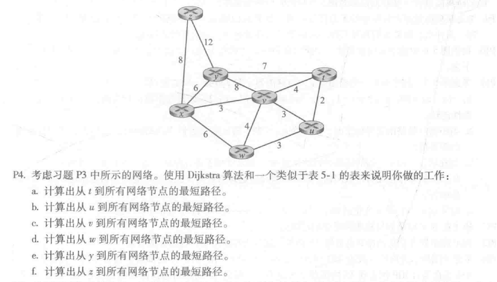
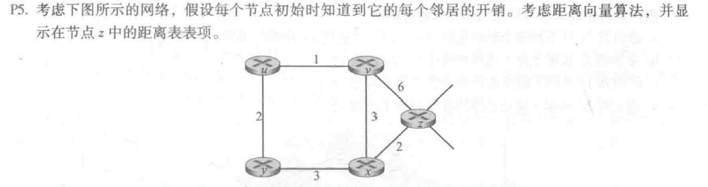
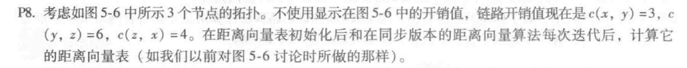

# 第9次作业

Author：陈俊杰

StuNo:  2017302580109

选取第五章——网络层：控制平面的3道习题：

1. P4

   

   > 做本题主要实践Dijkstra算法。
   >
   > 解答：
   >
   > a)
   >
   > | 步骤 | $N^{'}$ | D(x),p(x) | D(u),p(u) | D(v),p(v) | D(w),p(w) | D(y),p(y) | D(z),p(z) |
   > | ---- | ------- | --------- | --------- | --------- | --------- | --------- | --------- |
   > | 0    | x       | $\infty$  | 2,t       | 4,t       | $\infty$  | 7,t       | $\infty$  |
   > | 1    | xv      | $\infty$  | 2,t       | 4,t       | 5,u       | 7,t       | $\infty$  |
   > | 2    | xvu     | 7,v       | 2,t       | 4,t       | 5,u       | 7,t       | $\infty$  |
   > | 3    | xvuw    | 7,v       | 2,t       | 4,t       | 5,u       | 7,t       | $\infty$  |
   > | 4    | xvuwy   | 7,v       | 2,t       | 4,t       | 5,u       | 7,t       | 15,x      |
   > | 5    | xvuwyt  | 7,v       | 2,t       | 4,t       | 5,u       | 7,t       | 15,x      |
   > | 6    | xvuwytz | 7,v       | 2,t       | 4,t       | 5,u       | 7,t       | 15,x      |
   >
   > b)
   >
   > | 步骤 | $N^{'}$ | D(x),p(x) | D(t),p(t) | D(v),p(v) | D(w),p(w) | D(y),p(y) | D(z),p(z) |
   > | ---- | ------- | --------- | --------- | --------- | --------- | --------- | --------- |
   > | 0    | x       | $\infty$  | 2,u       | 3,u       | 3,u       | $\infty$  | $\infty$  |
   > | 1    | xv      | $\infty$  | 2,u       | 3,u       | 3,u       | 9,t       | $\infty$  |
   > | 2    | xvu     | 6,v       | 2,u       | 3,u       | 3,u       | 9,t       | $\infty$  |
   > | 3    | xvuw    | 6,v       | 2,u       | 3,u       | 3,u       | 9,t       | $\infty$  |
   > | 4    | xvuwy   | 6,v       | 2,u       | 3,u       | 3,u       | 9,t       | 14,x      |
   > | 5    | xvuwyt  | 6,v       | 2,u       | 3,u       | 3,u       | 9,t       | 14,x      |
   > | 6    | xvuwytz | 6,v       | 2,u       | 3,u       | 3,u       | 9,t       | 14,x      |
   >
   > c)
   >
   > | step | $N^{'}$ | D(x),p(x) | D(u),p(u) | D(t),p(t) | D(w),p(w) | D(y),p(y) | D(z),p(z) |
   > | ---- | ------- | --------- | --------- | --------- | --------- | --------- | --------- |
   > | 0    | v       | 3,v       | 3,v       | 4,v       | 4,v       | 8,v       | $\infty$  |
   > | 1    | vx      | 3,v       | 3,v       | 4,v       | 4,v       | 8,v       | 11,x      |
   > | 2    | vxu     | 3,v       | 3,v       | 4,v       | 4,v       | 8,v       | 11,x      |
   > | 3    | vxut    | 3,v       | 3,v       | 4,v       | 4,v       | 8,v       | 11,x      |
   > | 4    | vxutw   | 3,v       | 3,v       | 4,v       | 4,v       | 8,v       | 11,x      |
   > | 5    | vxutwy  | 3,v       | 3,v       | 4,v       | 4,v       | 8,v       | 11,x      |
   > | 6    | vxutwyz | 3,v       | 3,v       | 4,v       | 4,v       | 8,v       | 11,x      |
   >
   > d)
   >
   > | 步骤 | $N^{'}$ | D(x),p(x) | D(u),p(u) | D(v),p(v) | D(t),p(t) | D(y),p(y) | D(z),p(z) |
   > | ---- | ------- | --------- | --------- | --------- | --------- | --------- | --------- |
   > | 0    | w       | 6,w       | 3,w       | 4,w       | $\infty$  | $\infty$  | $\infty$  |
   > | 1    | wu      | 6,w       | 3,w       | 4,w       | 5,u       | $\infty$  | $\infty$  |
   > | 2    | wuv     | 6,w       | 3,w       | 4,w       | 5,u       | 12,v      | $\infty$  |
   > | 3    | wuvt    | 6,w       | 3,w       | 4,w       | 5,u       | 12,v      | $\infty$  |
   > | 4    | wuvtx   | 6,w       | 3,w       | 4,w       | 5,u       | 12,v      | 14,x      |
   > | 5    | wuvtxy  | 6,w       | 3,w       | 4,w       | 5,u       | 12,v      | 14,x      |
   > | 6    | wuvtxyz | 6,w       | 3,w       | 4,w       | 5,u       | 12,v      | 14,x      |
   >
   > e)
   >
   > | 步骤 | $N^{'}$ | D(x),p(x) | D(u),p(u) | D(v),p(v) | D(w),p(w) | D(t),p(t) | D(z),p(z) |
   > | ---- | ------- | --------- | --------- | --------- | --------- | --------- | --------- |
   > | 0    | y       | 6,y       | $\infty$  | 8,y       | $\infty$  | 7,y       | 12,y      |
   > | 1    | yx      | 6,y       | $\infty$  | 8,y       | 12,x      | 7,y       | 12,y      |
   > | 2    | yxt     | 6,y       | 9,t       | 8,y       | 12,x      | 7,y       | 12,y      |
   > | 3    | yxtv    | 6,y       | 9,t       | 8,y       | 12,x      | 7,y       | 12,y      |
   > | 4    | yxtvu   | 6,y       | 9,t       | 8,y       | 12,x      | 7,y       | 12,y      |
   > | 5    | yxtvuw  | 6,y       | 9,t       | 8,y       | 12,x      | 7,y       | 12,y      |
   > | 6    | yxtvuwz | 6,y       | 9,t       | 8,y       | 12,x      | 7,y       | 12,y      |
   >
   > f)
   >
   > | 步骤 | $N^{'}$ | D(x),p(x) | D(u),p(u) | D(v),p(v) | D(w),p(w) | D(y),p(y) | D(t),p(t) |
   > | ---- | ------- | --------- | --------- | --------- | --------- | --------- | --------- |
   > | 0    | z       | 8,z       | $\infty$  | $\infty$  | $\infty$  | 12,z      | $\infty$  |
   > | 1    | zx      | 8,z       | $\infty$  | 11,x      | 14,x      | 12,z      | $\infty$  |
   > | 2    | zxv     | 8,z       | 14,v      | 11,x      | 14,x      | 12,z      | 15,v      |
   > | 3    | zxvy    | 8,z       | 14,v      | 11,x      | 14,x      | 12,z      | 15,v      |
   > | 4    | zxvyu   | 8,z       | 14,v      | 11,x      | 14,x      | 12,z      | 15,v      |
   > | 5    | zxvyuw  | 8,z       | 14,v      | 11,x      | 14,x      | 12,z      | 15,v      |
   > | 6    | zxvyuwt | 8,z       | 14,v      | 11,x      | 14,x      | 12,z      | 15,v      |

2. P5

   

   >本题主要距离向量算法——动态规划。
   >
   >解答：
   >
   >|      | u        | v        | x        | y        | z        |
   >| ---- | -------- | -------- | -------- | -------- | -------- |
   >| v    | $\infty$ | $\infty$ | $\infty$ | $\infty$ | $\infty$ |
   >| x    | $\infty$ | $\infty$ | $\infty$ | $\infty$ | $\infty$ |
   >| z    | $\infty$ | 6        | 2        | $\infty$ | 0        |
   >
   >|      | u        | v    | x    | y        | z    |
   >| ---- | -------- | ---- | ---- | -------- | ---- |
   >| v    | 1        | 0    | 3    | $\infty$ | 6    |
   >| x    | $\infty$ | 3    | 0    | 3        | 2    |
   >| z    | 7        | 5    | 2    | 5        | 0    |
   >
   >|      | u    | v    | x    | y    | z    |
   >| ---- | ---- | ---- | ---- | ---- | ---- |
   >| v    | 1    | 0    | 3    | 3    | 5    |
   >| x    | 4    | 3    | 0    | 3    | 2    |
   >| z    | 6    | 5    | 2    | 5    | 0    |
   >
   >|      | u    | v    | x    | y    | z    |
   >| ---- | ---- | ---- | ---- | ---- | ---- |
   >| v    | 1    | 0    | 3    | 3    | 5    |
   >| x    | 4    | 3    | 0    | 3    | 2    |
   >| z    | 6    | 5    | 2    | 5    | 0    |

3. P8

   

   >解答：
   >
   >x的表：
   >
   >|      | x        | y        | z        |
   >| ---- | -------- | -------- | -------- |
   >| x    | 0        | 3        | 4        |
   >| y    | $\infty$ | $\infty$ | $\infty$ |
   >| z    | $\infty$ | $\infty$ | $\infty$ |
   >
   >|      | x    | y    | z    |
   >| ---- | ---- | ---- | ---- |
   >| x    | 0    | 3    | 4    |
   >| y    | 3    | 0    | 6    |
   >| z    | 4    | 6    | 0    |
   >
   >y的表
   >
   >|      | x        | y        | z        |
   >| ---- | -------- | -------- | -------- |
   >| x    | $\infty$ | $\infty$ | $\infty$ |
   >| y    | 3        | 0        | 6        |
   >| z    | $\infty$ | $\infty$ | $\infty$ |
   >
   >|      | x    | y    | z    |
   >| ---- | ---- | ---- | ---- |
   >| x    | 0    | 3    | 4    |
   >| y    | 3    | 0    | 6    |
   >| z    | 4    | 6    | 0    |
   >
   >z的表
   >
   >|      | x        | y        | z        |
   >| ---- | -------- | -------- | -------- |
   >| x    | $\infty$ | $\infty$ | $\infty$ |
   >| y    | $\infty$ | $\infty$ | $\infty$ |
   >| z    | 4        | 6        | 0        |
   >
   >|      | x    | y    | z    |
   >| ---- | ---- | ---- | ---- |
   >| x    | 0    | 3    | 4    |
   >| y    | 3    | 0    | 6    |
   >| z    | 4    | 6    | 0    |