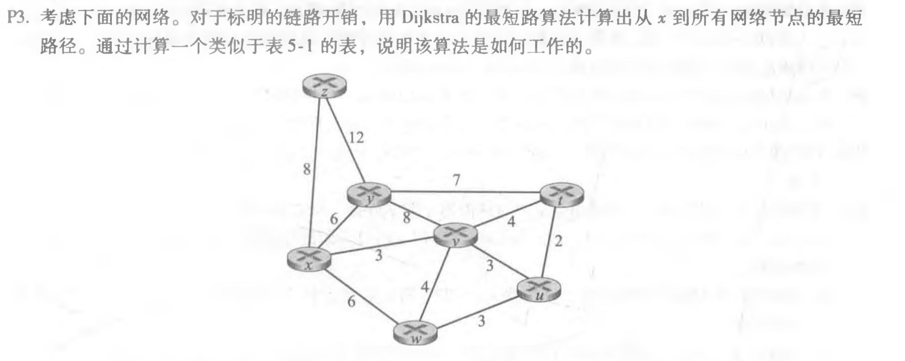
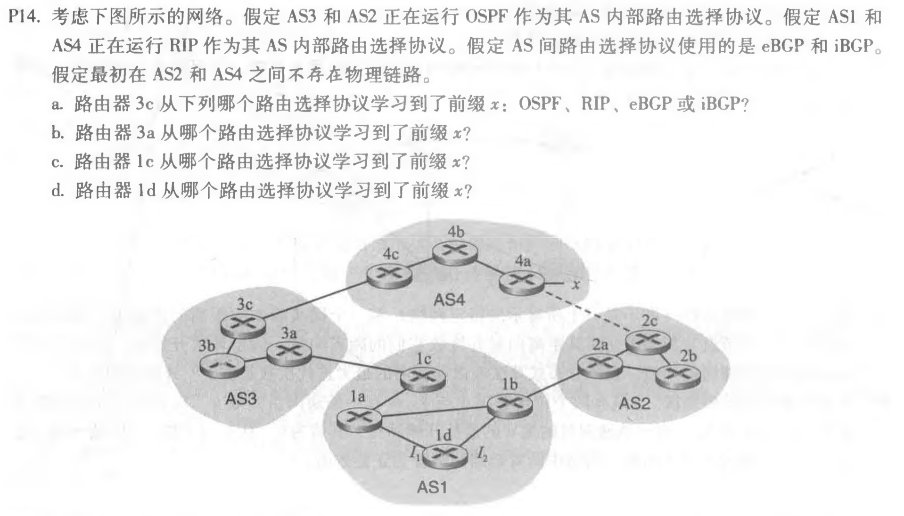

## 第九次作业

------

### 1. P1

从y到u不包含任何环路的路径有：

y-x-u,y-x-v-u,y-x-w-u,y-x-w-v-u,y-w-u,y-w-v-u,y-w-x-u,y-w-x-v-u,y-w-v-x-u,y-z-w-u,y-z-w-v-u,y-z-w-x-u,y-z-w-x-v-u,y-z-w-v-x-u

------

### 2. P3

如下表所示：

| step | N'      | D(t),p(t) | D(u),p(u) | D(v),p(v) | D(w),p(w) | D(y),p(y) | D(z),p(z) |
| ---- | ------- | --------- | --------- | --------- | --------- | --------- | --------- |
| 0    | x       | \infty∞   | \infty∞   | 3,x       | 6,x       | 6,x       | 8,x       |
| 1    | xv      | 7,v       | 6,v       | 3,x       | 6,x       | 6,x       | 8,x       |
| 2    | xvu     | 7,v       | 6,v       | 3,x       | 6,x       | 6,x       | 8,x       |
| 3    | xvuw    | 7,v       | 6,v       | 3,x       | 6,x       | 6,x       | 8,x       |
| 4    | xvuwy   | 7,v       | 6,v       | 3,x       | 6,x       | 6,x       | 8,x       |
| 5    | xvuwyt  | 7,v       | 6,v       | 3,x       | 6,x       | 6,x       | 8,x       |
| 6    | xvuwytz | 7,v       | 6,v       | 3,x       | 6,x       | 6,x       | 8,x       |

------

### 3. P14

a. eBGP

b. iBGP

c. eBGP

d. iBGP