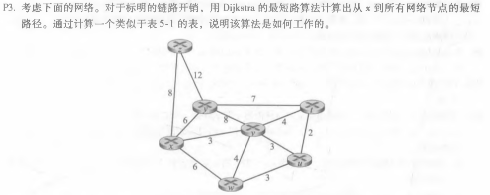
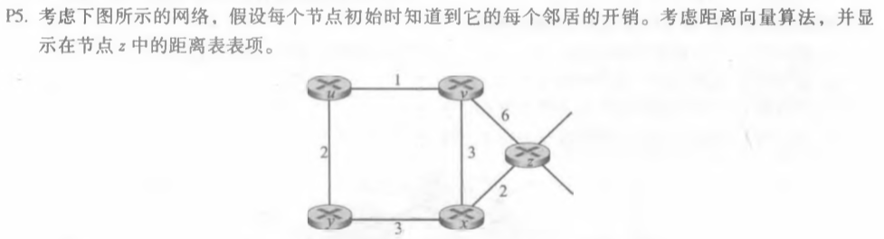
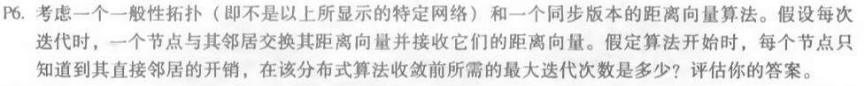

## *第九次作业*

---------------------------------------------  
### 第五章课后习题任选三题  
#### P3

##### 答：  

| 步骤 |   N'  | D(v),P(v) | D(w),P(w) | D(u),P(u)|D(t),P(t)|D(y),P(y)|D(z),P(z)| 
| :-: |:------| :--------:|:--------:|:--------:|:--------:|:--------:|:--------:|
| 0 | x       | 3,x | 6,x |∞  | ∞   |6,x|8,x |
| 1 | xv      |     | 6,x |6,v| 7,v| 6,x| 8,x|  
| 2 | xvu      |    | 6,x |   | 7,v|6,x|8,x|
| 3 |xvuw      |   |      |    |7,v|6,x|8,x|
| 4 |xvuwy     |   |      |    |7,v|   |8,x|
| 5| xvuwyt    |   |      |    |   |   | 8,x|
| 6 | xvuwytz  |   |      |    |    |   |   |
#### P5   

##### 答：  
|   从 \  到  | z | v | x | u | y | 
|:---:       |:-:|:-:|:-:|:-:|:-:|
|z           |0  |6  |2  |∞|∞|
|v           |∞|∞|∞|∞|∞|
|x           |∞|∞|∞|∞|∞|

|   从 \  到  | z | v | x | u | y | 
|:---:       |:-:|:-:|:-:|:-:|:-:|
|z           |0  |5  |2  |7|5|
|v           |6|0|3|1|∞|
|x           |2|3|0|∞|3|

|   从 \  到  | z | v | x | u | y | 
|:---:       |:-:|:-:|:-:|:-:|:-:|
|z           |0  |5  |2  |6|5|
|v           |5|0|3|1|3|
|x           |2|3|0|4|3|

|   从 \  到  | z | v | x | u | y | 
|:---:       |:-:|:-:|:-:|:-:|:-:|
|z           |0  |5  |2  |6|5|
|v           |5|0|3|1|3|
|x           |2|3|0|4|3|

#### P6  

##### 答：  
d是⽹络中任何两个节点之间最⻓的⽆环路路径的⻓度。经过d-1迭代后，所有节点都将知道d长度路径以内节点的最短路径代价。 任何⼤于d的路径都会有循环，该算法最多会在d-1迭代中收敛。  
说明：假定算法开始时，每个节点知道其直接邻居的开销，这是初始条件,不算做一次迭代。
