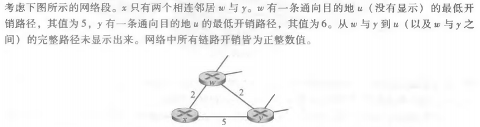

## 课后习题

### p3

答：

D(v)表示到算法的本次迭代，从源节点到目的节点v的最低开销路径的开销

p(v)从源到v沿着当前最低开销路径的前一节点

| 步骤 | N'            | D(z),p(z) | D(y),p(y) | D(w),p(w) | D(v),p(v) | D(u),p(u) | D(t),p(t) |
| ---- | ------------- | --------- | --------- | --------- | --------- | --------- | --------- |
| 0    | x             | 8,x       | 6,x       | 6,x       | 3,x       | INF       | INF       |
| 1    | x,v           | 8,x       | 6,x       | 6,x       |           | 6,v       | 7,v       |
| 2    | x,v,y         | 8,x       |           | 6,x       |           | 6,v       | 7,v       |
| 3    | x,v,y,w       | 8,x       |           |           |           | 6,v       | 7,v       |
| 4    | x,v,y,w,u     | 8,x       |           |           |           |           | 7,v       |
| 5    | x,v,y,w,u,t   | 8,x       |           |           |           |           |           |
| 6    | x,v,y,w,u,t,z |           |           |           |           |           |           |

### p7

a) Dx(w) = 2; Dx(y) = 4; Dx(u)= 7

b) 

if(c(x,y)<1)则会告知有一条更短路径，x->y->u

if(c(x,w)>6)则会告知有一条更短路径，x->y->u

c) 

if(c(x,y)>=1)不会告知有更短路径到u

if(c(x,w)<=6)不会告知有更短路径到u

### p11

答： 解答如下图

因为使用了反向下毒，最短路径经过其中的点时通告为INF

