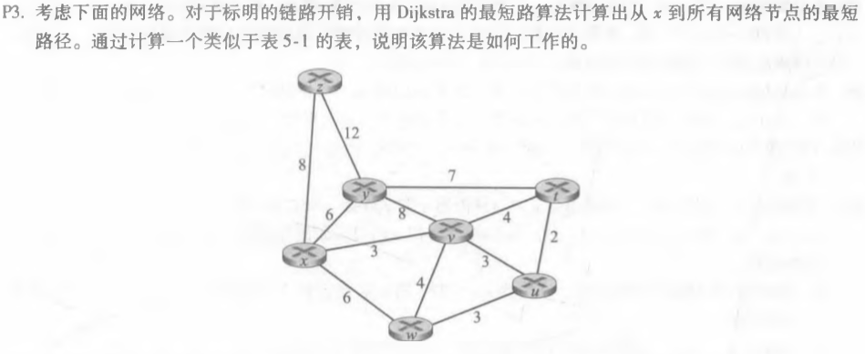
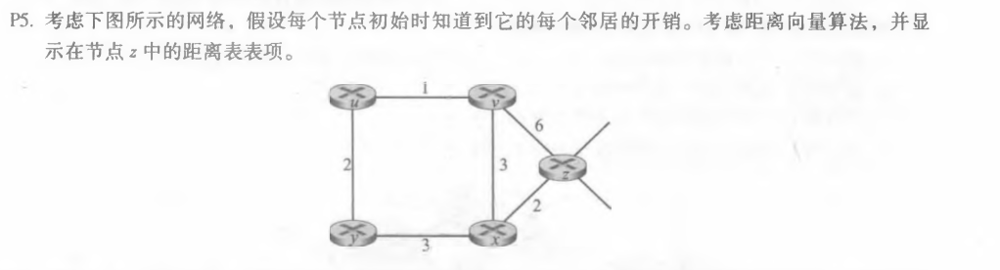
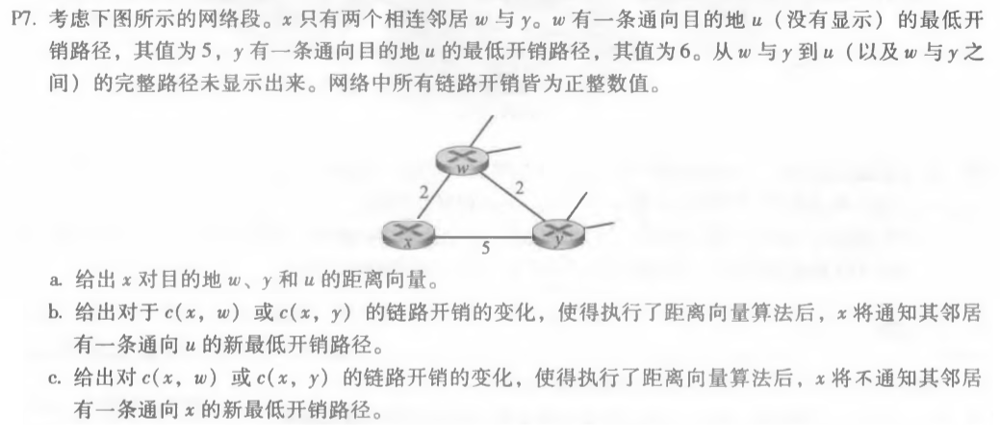

## P3
 
          
<table>
<tr><td>step</td><td>N</td><td>D(t),P(t)</td><td>D(u),P(u)</td><td>D(v),P(v)</td><td>D(w),P(w)</td><td>D(y),P(y)</td><td>D(z),P(z)</td></tr>
<tr><td>0</td><td>x</td><td>∞</td><td>∞</td><td>3,x</td><td>6,x</td><td>6,x</td><td>8,x</td> </tr>
<tr><td>1</td><td>xv</td><td>7,v</td><td>6,v</td><td></td><td>6,x</td><td>6,x</td><td>8,x</td> </tr>
<tr><td>2</td><td>xvu</td><td>7,v</td><td></td><td></td><td>6,x</td><td>6,x</td><td>8,x</td> </tr>
<tr><td>3</td><td>xvuw</td><td>7,v</td><td></td><td></td><td></td><td>6,x</td><td>8,x</td> </tr>
<tr><td>4</td><td>xvuwy</td><td>7,v</td><td></td><td></td><td></td><td></td><td>8,x</td> </tr>
<tr><td>5</td><td>xvuwyt</td><td></td><td></td><td></td><td></td><td></td><td>8,x</td> </tr>
<tr><td>6</td><td>xvuwytz</td><td></td><td></td><td></td><td></td><td></td><td></td> </tr>
</table>
最短路径 
t:x-v-t  7 
u:x-v-u  6 
v:x-v    3 
w:x-w    6 
y:x-y    6 
z:x-z    8 

## P5
 
<table>
<tr> <td> </td>   <td>u</td>  <td>v</td>  <td>x</td>   <td>y</td>   <td>z</td> </tr>
<tr> <td>v</td>   <td>∞</td>  <td>∞</td>  <td>∞</td>   <td>∞</td>   <td>∞</td> </tr>
<tr> <td>x</td>   <td>∞</td>  <td>∞</td>  <td>∞</td>   <td>∞</td>   <td>∞</td> </tr>
<tr> <td>z</td>   <td>∞</td>  <td>6</td>  <td>2</td>   <td>∞</td>   <td>0</td> </tr>
</table>--->
<table>
<tr> <td> </td>   <td>u</td>  <td>v</td>  <td>x</td>   <td>y</td>   <td>z</td> </tr>
<tr> <td>v</td>   <td>1</td>  <td>0</td>  <td>3</td>   <td>∞</td>   <td>6</td> </tr>
<tr> <td>x</td>   <td>∞</td>  <td>3</td>  <td>0</td>   <td>3</td>   <td>2</td> </tr>
<tr> <td>z</td>   <td>7</td>  <td>6</td>  <td>2</td>   <td>5</td>   <td>0</td> </tr>
</table>--->
<table>
<tr> <td> </td>   <td>u</td>  <td>v</td>  <td>x</td>   <td>y</td>   <td>z</td> </tr>
<tr> <td>v</td>   <td>1</td>  <td>0</td>  <td>3</td>   <td>3</td>   <td>5</td> </tr>
<tr> <td>x</td>   <td>4</td>  <td>3</td>  <td>0</td>   <td>3</td>   <td>2</td> </tr>
<tr> <td>z</td>   <td>6</td>  <td>6</td>  <td>2</td>   <td>5</td>   <td>0</td> </tr>
</table>--->
<table>
<tr> <td> </td>   <td>u</td>  <td>v</td>  <td>x</td>   <td>y</td>   <td>z</td> </tr>
<tr> <td>v</td>   <td>1</td>  <td>0</td>  <td>3</td>   <td>3</td>   <td>5</td> </tr>
<tr> <td>x</td>   <td>4</td>  <td>3</td>  <td>0</td>   <td>3</td>   <td>2</td> </tr>
<tr> <td>z</td>   <td>6</td>  <td>6</td>  <td>2</td>   <td>5</td>   <td>0</td> </tr>
</table> 

## P7

a.D(w)=2,D(y)=4,D(u)=7 
b.对于c(x,w)的变化，c(x,y)的路径也会改变，但不会大于5。当c(x,w)>6时x将通知邻居有一条通向u的新最低开销路径 
&nbsp;&nbsp;&nbsp;
对于c(x,y)的变化，c(x,w)的路径不会改变(c(x,y)>0)。当c(x,y)<1时x将通知邻居有一条通向u的新最低开销路径 
c.由b可得c(x,w)<=6及c(x,y)>=1时,x不通知邻居有一条通向u的新最低开销路径 
 

 
刘涛 2017302580292 2020.05.12

