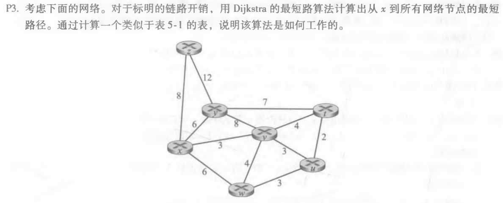
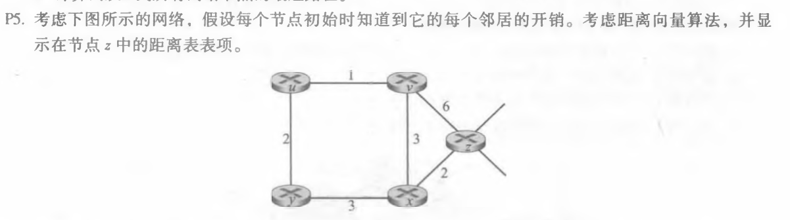
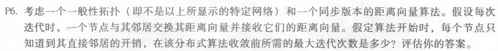

#### 1. P3

| 步骤 | N‘      | D(t),p(t) | D(u),p(u) | D(v),p(v) | D(w),p(w) | D(y),p(y) | D(z),p(z) |
| ---- | ------- | --------- | --------- | --------- | --------- | --------- | --------- |
| 0    | x       | $\infty$  | $\infty$  | 3,x       | 6,x       | 6,x       | 8,x       |
| 1    | xv      | 7,v       | 6,v       |           | 6,x       | 6,x       | 8,x       |
| 2    | xvu     | 7,v       |           |           | 6,x       | 6,x       | 8,x       |
| 3    | xvuw    | 7,v       |           |           | 6,x       |           | 8,x       |
| 4    | xvuwy   | 7,v       |           |           |           |           | 8,x       |
| 5    | xvuwyt  |           |           |           |           |           | 8,x       |
| 6    | xvuwytz |           |           |           |           |           |           |

#### 2. P5

|      | v        | x        | z        | y        | u        |
| ---- | -------- | -------- | -------- | -------- | -------- |
| v    | $\infty$ | $\infty$ | $\infty$ | $\infty$ | $\infty$ |
| x    | $\infty$ | $\infty$ | $\infty$ | $\infty$ | $\infty$ |
| z    | 6        | 2        | 0        | $\infty$ | $\infty$ |

|      | v    | x    | z    | y        | u        |
| ---- | ---- | ---- | ---- | -------- | -------- |
| v    | 0    | 3    | 6    | $\infty$ | 1        |
| x    | 3    | 0    | 2    | 3        | $\infty$ |
| z    | 5    | 2    | 0    | 5        | 7        |

|      | v    | x    | z    | y    | u    |
| ---- | ---- | ---- | ---- | ---- | ---- |
| v    | 0    | 3    | 5    | 3    | 1    |
| x    | 3    | 0    | 2    | 3    | 4    |
| z    | 5    | 2    | 0    | 5    | 6    |

|      | v    | x    | z    | y    | u    |
| ---- | ---- | ---- | ---- | ---- | ---- |
| v    | 0    | 3    | 5    | 3    | 1    |
| x    | 3    | 0    | 2    | 3    | 4    |
| z    | 5    | 2    | 0    | 5    | 6    |

#### 3. P6

假设d为网络中任何两个节点之间最长的无环路径长度。因为每次迭代，节点都需要和其邻居交换其距离向量并接收它们的距离向量。那么d-1次迭代后，所有节点都知道到达其他节点的最短路径代价。

